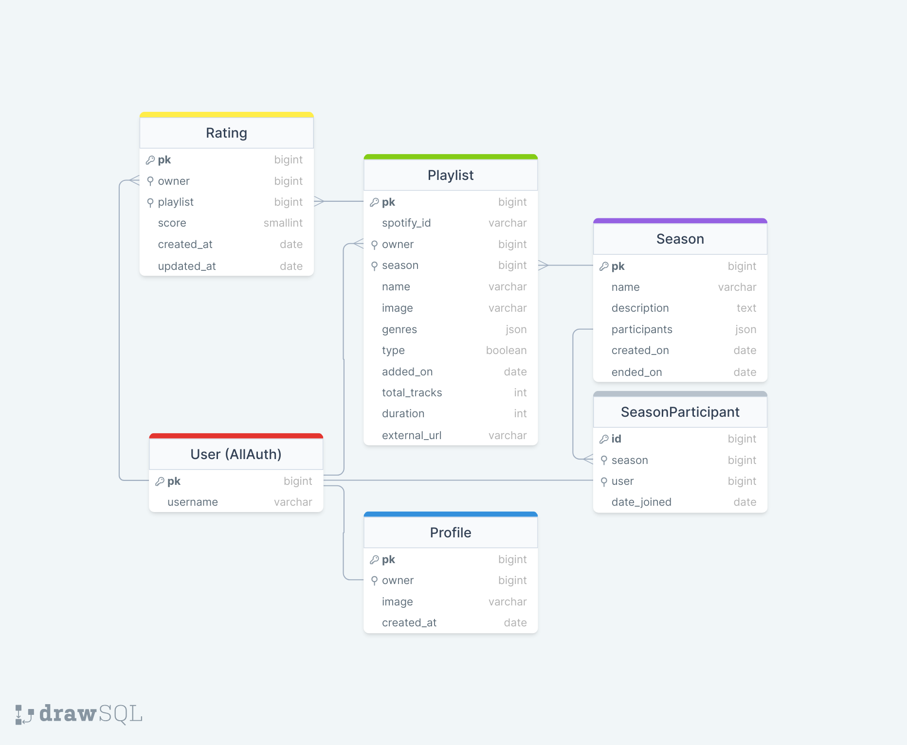

# We Rate Music

## Project Goals

## Table of Contents

1. [Planning](#planning)

- [User Stories](#user-stories)
- [Wireframes, Fonts & Colours](#wireframes-fonts--colours)
- [Database Modeling](#database-modeling)
- [Agile Development](#agile-development)

2. [Django Rest Framework](#django-rest-framework)

- [The Database](#the-database)
- [Feedback](#feedback)
- [Profile](#profile)
- [Playlist](#playlist)
- [Rating](#rating)
- [Follower](#follower)
- [API Endpoints](#api-endpoints)

3. [Frontend React Application](#frontend-react-application)

- [Workflows](#workflows)

- [API](#api)

  - [AxiosDefaults](#axiosdefaults)

- [Components](#components—features)

  - [AccordionWindow](#accordionwindow)
  - [Avatar](#avatar)
  - [LoadingSpinner](#loadingspinner)
  - [ModalWindow](#modalwindow)
  - [NavBar](#navbar)
  - [Playlist](#playlist)
  - [Profile](#profile)
  - [SearchBar](#searchbar)
  - [SignOutButton](#signoutbutton)
  - [StarRating](#starrating)

- [Contexts](#contexts)

  - [CurrentUserContext](#currentusercontext)
  - [SpotifyPlayerUriContext](#spotifyplayeruricontext)

- [Forms](#forms)

  - [FeedbackCreateForm](#feedbackcreateform)
  - [PlaylistEditForm](#playlisteditform)
  - [ProfileEditForm](#profileeditform)

- [Hooks](#hooks)

  - [useRedirect](#useredirect)

- [Pages](#pages)

  - [Auth](#auth)
    - [SignInForm](#signinform)
    - [SignUpForm](#signupform)
  - [Homepage](#homepage)
  - [PageNotFound404](#pagenotfound404)
  - [PlaylistDetail](#playlistdetail)
  - [PlaylistsPage](#playlistspage)
  - [ProfilePage](#profilepage)
  - [SpotifySearchPage](#spotifysearchpage)

- [Spotify](#spotify)

  - [AddPlaylistButton](#addplaylistbutton)
  - [SpotifyPlayer](#spotifyplayer)
  - [SpotifySearchPage](#spotifysearchpage)
  - [useSpotifyAuth](#usespotifyauth)

4. [Future Features/Roadmap](#future-featuresroadmap)

5. [Testing](#testing)

6. [Challenges & Bugs](#challenges—bugs)

7. [Technologies Used](#technologies-used)

   - [Frameworks, libraries, and dependencies](#frameworks—libraries—and-dependencies)

8. [Deployment](#deployment)

9. [Creating the Heroku app](#creating-the-heroku-app)

10. [Development](#development)

11. [Credits](#credits)

## Planning

### User Stories

1. As a user I can navigate the app using a “social media style navbar” so that I can easily navigate between pages.
2. As a user I can navigate through pages quickly and seamlessly without the annoying page refresh.
3. As a user I can create a new account so that I can access all features for signup up users.
4. As a user I can sign in to the app so that I can access functionality for logged in users.
5. As a logged out user I see different navigation elements to when I’m logged in for a better user experience.
6. As a user I can remain logged in until I choose to log out so my experience on the app isn’t cut short unnecessarily.
7. As a user I can view user’s avatars so that I can easily identify users of the application and see my own avatar in the profile tab.
8. As a user I can authorise the application to use my Spotify credentials so that I can benefit from using all the extra features the app provides.
9. As a user I can search for playlists/albums and artists on Spotify without leaving the application.
10. As a user I can listen to the playlists/albums that are returned from my search, so that I can decide if I like them or not, plus the added convenience of not leaving the application.
11. After searching for playlists on Spotify, as a user, I can decide to add certain playlists/albums to my profile so that other users can view my personalised selection of playlists and rate them.
12. As a user I can edit my playlists from within the app, such as the name and album artwork, and have the app update my Spotify account for me so that the change is reflected on Spotify too.
13. As a user I can minimise the Spotify player, continue listening to music while still enjoying browsing other playlists.
14. As a user I can continue browsing the entire app while listening to playlists uninterrupted.
15. As a user I can view my profile so that I can view all the playlists I’ve added in one place.
16. As a user I can click on a playlist to view its details, so that I may see its average rating for example.
17. As a user I can view playlists I have already rated, so that I can update them and more importantly have a section of the app dedicated to playlists I have likely enjoyed.
18. As a user I can view other users’ profiles so that I can see their collection of playlists and listen to them.
19. As a user I can follow other users so that I can more easily keep track of playlists they add.
20. As a user I get notified when I have a new follower, so that I am aware and can potentially follow them back.
21. As a user I can send private message to other users I follow, so that I can stay in touch with other users and comment privately to them.
22. As a user I can view all the most recent playlist submissions by other users so that I can stay up to date with the newest content.
23. As user I can keep scrolling through playlists without the need to click the next page, this would be far better for my user experience.
24. As a user I can sort the rated playlist view in order of score given to ratings, so that my higher rated playlists appear higher up in the view.
25. As a user I want to be able to rate my own and other users' playlists, so that I can express my opinion on them.
26. As a user I can update my already existing ratings so that I can change my mind at a later time and increase or decrease a playlists score.
27. As a user I can delete a rating I have submitted in the past, so that it doesn't appear in my '/rated-playlists' feed.
28. As a user, I'd like to be able to update playlists in my profile so that I can change their name and add a small description about them. That way I can express why I chose to add the playlist and say a little about what occasions the playlists are best for.
29. As a user, I can view some basic statistics in profiles, such as the number of playlists belonging to the profile, the number of users the profile is following and the number of users following the profile.
30. As a user, I can edit my profile image and the background image, so that I can personalise my profile view for myself and others to see.
31. As a user I'd like to be able to search for other user so that I can view their profiles and potentially follow them.
32. As a user, I'd like to have a smoother experience when using the search bar to search for users, so that I have a better experience using the app more generally.
33. As a user, I'd like to be able to sign out of the application so that my is secure when I am away from my computer.
34. As a user, I can send feedback to the site owner, so that I can share with them my experiences with the app and hopefully use my input to improve my experiences further.
35. As a site owner, I can view the feedback and suggestions submitted by my users so that I can improve the user experience further, and pick up on bugs faster.

  <a href="#">Back to the top</a>

### Wireframes, Fonts & Colours

### Database Modeling

### Agile Development

## Django Rest Framework

### The Database

* Used drawsql.app to make the database schema

#### User Model

The user model is a default model provided by Django all-auth.

#### Profile Model

The profile model is a custom model that extends the default user model. It includes the following fields:

- ‘owner’: OneToOneField with Django allauth's User model
- ‘created_at’: Automatically generated DateTimeField
- ‘image’: ImageField to store the user’s profile picture to Cloudinary

Django's post_save signal is used to create a Profile object when a User object is made/user registers.

#### Playlist Model

The playlist model is a custom model that includes the following fields:

- ‘spotify_id’: CharField; to store the unique ID given by Spotify to its playlists/albums
- ‘owner’: ForeignKey with the User model
- 'season': ForeignKey with the Season model
- 'name': CharField
- ‘image’: URLField
- 'type': 2 Choices; 'p' for Playlist, 'a' for Album
- ‘added_on’: Automatically generated DateTimeField
- 'total_tracks': PositiveIntegerField
- 'duration': PositiveBigIntegerField
- 'external_url': URLField

Restrictions are in place to restrict to one playlist per season per user.

#### Rating Model

The rating model is a custom model that includes the following fields:

- ‘owner’: ForeignKey with the User model
- ‘playlist’: ForeignKey with the Playlist model
- ‘score’: PositiveSmallIntegerField; range of 1-10
- ‘created_at’: Automatically generated DateTimeField
- ‘updated_at’: Automatically generated DateTimeField

Restrictions are in place to restrict one rating per playlist per user.

#### Season Model

The rating model is a custom model that includes the following fields:

- 'name': CharField
- 'description': TextField
- 'participants': ManyToManyField; User through the SeasonParticipant model
- 'created_on': Automatically generated DateTimeField
- 'ended_on': DateTimeField

#### Season Participant (Intermediary) Model

The season participant model is an intermediary model that references User and Season and additionally stores the date of when a user joined:

- 'season': ForeignKey with the Season model
- 'user': ForeignKey with the User model
- 'joined_on': Automatically generated DateTimeField

Restrictions are in place to restrict users from joining the same Season and or joining a Season after it has ended.

#### Spotify Token Model

The Spotify token model is a custom model that includes the following fields:

- ‘owner’: OneToOneField with the User model
- 'access_token': CharField
- 'token_type': CharField
- 'last_refreshed': Automatically generated DateTimeField
- ‘expires_at’: DateTimeField
- 'refresh_token': CharField

### API Endpoints

The following API endpoints were created to serve the React frontend application:

- '' - The root endpoint, which redirects to index.html/homepage.
- 'admin/' - The Django admin panel.
- 'api/api-auth/' - The Django Rest Framework authentication endpoint. (NOTE: CURRENTLY NOT IN USE)
- 'api/dj-rest-auth/' - The Django Rest Framework authentication endpoint. (NOTE: CURRENTLY NOT IN USE)
- 'api/dj-rest-auth/registration/' - The Django Rest Framework registration endpoint.
- 'api/token/' - The login endpoint.
- 'api/token/refresh' - Refresh access key endpoint.
- 'api/profiles/' - View profiles list view.
- 'api/profiles/:pk' - Profile detail view.
- 'api/seasons/' - View seasons list.
- 'api/seasons/:pk' - Detailed season view.
- 'api/seasons/:pk/participants' - View participants of a season in a list.
- 'api/playlists/' - View playlists list view.
- 'api/playlists/:pk' - Playlist detail view.
- 'api/ratings/' - View ratings list.
- 'api/ratings/:pk' - Detailed view of a rating.
- 'api/auth/spotify' - (NOTE: CURRENTLY NOT IN USE)
- 'api/auth/spotify/callback' - code and code_verifier from the frontend are sent back to start the token exchange, if successful the user will be granted an access_token by Spotify, which is then stored in the backend
- 'api/auth/spotify/refresh' - Django backend will search for the user making the request, if user exists and has a SpotifyToken object stored; the refresh_token value will be used to attempt to refresh the access_token through Spotify's API. (NOTE: Test what happens when refresh_token is also no longer valid - implement accordingly)
- 'api/auth/spotify/search' - Using the query set by the user in the frontend, will attempt to find a playlist/album using the Spotify API. (NOTE: must include more features, strip the album/playlist + ID directly from a shareable URL, for example)

  <a href="#">Back to the top</a>

## Frontend React Application

### Workflows

### API

#### AxiosDefaults

This file sets up Axios, a tool for HTTP requests in web apps, with '/api' as the base URL for simplicity. Two instances of axios are created, and exported; named axiosRequest and axiosResponse.

Both instances are modified in AuthContext.tsx (NOTE: Link here). (NOTE: Talk about what functionality was built in at the interceptors once complete!)

Axios interceptors:
request - sets auth headers if session is available (ie a user is logged in), refreshes access token, and updates session with new access_token (NOTE: no need every time; future implementations should address this better).
response - needs work

  <a href="#">Back to the top</a>

### /Components

#### Playlist

#### Profile

#### StarRating

### /Contexts

#### AuthContext

User's auth session context provider. Wrapped around the application in the root layout. Axios instances' interceptors are added here (NOTE: link to axiosDefaults here). Uses useStorageState to securely store user's session in expo-secure-storage.

Reference: https://docs.expo.dev/router/reference/authentication/

  <a href="#">Back to the top</a>

### /Forms

#### LoginForm

#### SignUpForm

#### SpotifySearchForm

### /Hooks

#### useSpotifyAuth

#### useStorageState

### /Pages

#### /Auth

#### Homepage

#### PageNotFound404

#### PlaylistDetail

#### PlaylistsPage

#### ProfilePage

### /Utils

#### dataUtils

## Testing

## Challenges & Bugs

## Technologies Used

- Python 3.12.1
- Django 3.2.23
- Django Rest Framework 3.14.0
- React 17.0.2

### Frameworks, libraries, and dependencies

- React (react, react-dom): Used to build the frontend application, providing a component-based architecture for building user interfaces.
- React Router DOM (react-router-dom): DOM bindings for React Router, enabling dynamic routing in a web app, allowing you to create navigable components in your React application.
- Axios (axios): A promise-based HTTP client for the browser and Node.js, making it easy to send asynchronous HTTP requests to REST endpoints and perform CRUD operations.
- JWT Decode (jwt-decode): A library to decode JSON Web Tokens (JWT) in client-side applications, useful for extracting user details or other payload information from tokens.

  <a href="#">Back to the top</a>

## Deployment

## **Development**

## **Credits**

### **Content**

- [Django Rest Framework Documentation](https://www.django-rest-framework.org/)
- [React Router Documentation](https://reactrouter.com/en/main)
- [Spotify API Documentation](https://developer.spotify.com/documentation/web-api)
- [Stack Overflow](https://stackoverflow.com/) - general enquiries/syntax
- [W3Schools](https://www.w3schools.com/) - general enquiries/syntax
- [JWT Decode](https://www.npmjs.com/package/jwt-decode)

  <a href="#">Back to the top</a>

